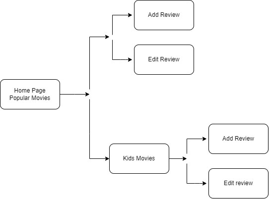
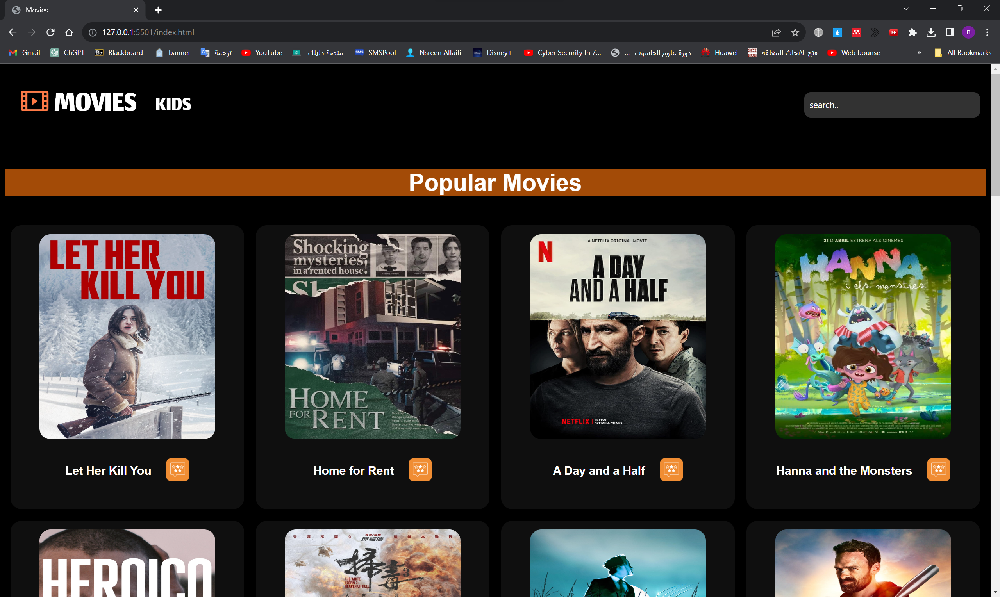
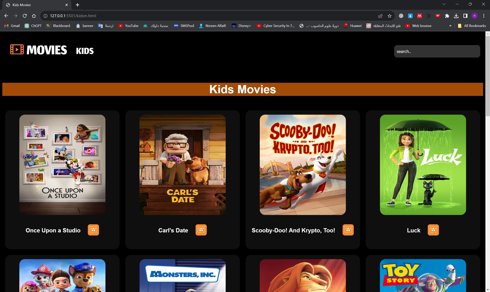
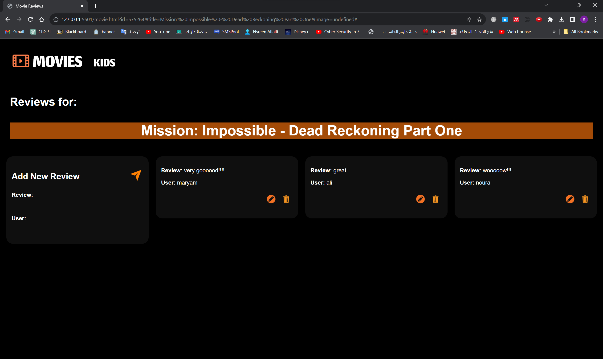
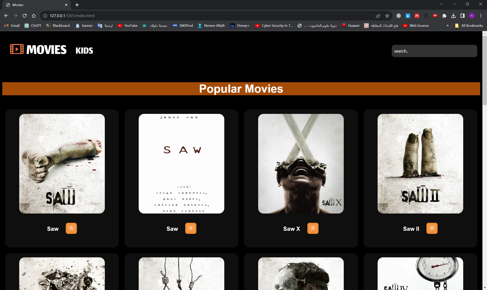

# Project-WebDevelopment-MoviesWebsite-2023
 
# Movie Website

Welcome to the Movie Website repository! This website provides a collection of popular movies and kids movies, along with the ability to add, edit, and delete reviews. It also features a search bar to find specific movies.

## Overview
The Movie Website is a web application designed to showcase popular movies and kids movies. It provides users with the ability to browse movies, add reviews, edit reviews, delete reviews, and search for specific movies. The website aims to provide an engaging and user-friendly experience for movie enthusiasts and families.

## Goals
1. Creating a user-friendly movie website with easy browsing and discovery.
2. Include a kids movies section for a safe and enjoyable experience.
3. Enable users to add, edit, and delete movie reviews for engagement.

## Key Features
1. **Movie Browsing and Discovery:** The website offers a curated collection of popular movies for users to explore. They can browse movies by genre and search for specific titles.
2. **User Reviews and Discussions:** Users can add, edit, and delete movie reviews to share their opinions and insights. The website fosters community engagement by enabling users to discuss movies, rate them, and interact with other reviewers.
3. **Kids Movies Section:** The website includes a dedicated section for kids movies, ensuring a safe and enjoyable browsing experience for young users. It offers a selection of age-appropriate content and parental controls.
4. **Powerful Search Functionality:** The search feature allows users to find movies quickly and efficiently. Users can search by movie title.

## Flowchart 

## Screenshots
1. The Main Page offers a collection of popular movies

2. The Kids Page offers a selection of movies suitable for children under 16

3. You can view, add, update, or delete reviews for any movie

4. Additionally, you can search for any movie you desire, such as 'SAW

## Technologies
The Movie Website is built using the following technologies:
- **Frontend:** HTML5, CSS3, JavaScript
- **Backend:** Node.js
- **Database:** MongoDB
- **Movie Data:** The Movie Database (TMDB) API ([TMDB Website](https://www.themoviedb.org/))

The frontend utilizes HTML5, CSS3, and JavaScript to create an intuitive and visually appealing user interface. The backend is developed using Node.js, a powerful and scalable JavaScript runtime. The website stores data in a MongoDB database, providing flexibility and scalability for managing movie information and user reviews. Additionally, the movie information is retrieved from The Movie Database (TMDB) API, allowing users to access a vast collection of movies and related data.
